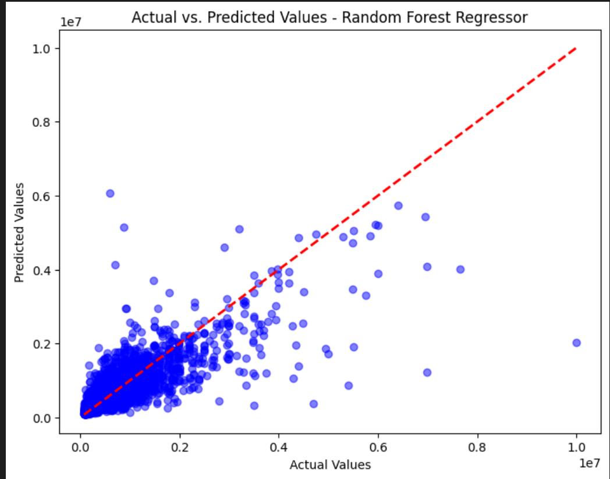

# immo-eliza-ml

## The Mission

The real estate company Immo Eliza asked you to create a machine learning model to predict prices of real estate properties in Belgium.

After the **scraping**, **cleaning** and **analyzing**, you are ready to preprocess the data and finally build a performant machine learning model!


## Learning Objectives

- Be able to preprocess data for machine learning.
- Be able to apply a linear regression in a real-life context.
- Be able to explore machine learning models for regression.
- Be able to evaluate the performance of a model


  ## Data

- **Dataset**: Trained on 76 000 property listings in Belgium, focusing on houses and apartments.
- **Target**: Listing price of each property.
- **Features**: Includes bedrooms, property type, location, living area, garden/terrace presence, etc.


## Model Details

- **Tested Models**: Linear Regression, Random Forest, Decision Tree Regressor.
- **Chosen Model**: Random Forest was selected for its balance of performance and interpretability.


## 📦 Repo structure
```.
├── IMMO-ELIZA-ML
│ └── properties.csv
├  ── properties_imputed.csv  
│  ── output_file.csv
├  ── test_data.csv
│  ── train_data.csv
│  ── predict.py
│  ── train.py
├  ── immoweb_regression.ipynb
├  ── .gitignore
├  ── immowebml(env)
├  ── README.md
└  ── requirements.txt 
```


## Performance

The Random Forest model achieved :
Train Score : 0.8932199931102398
Test Score: 0.6865430914031623
Mean Squared Error: 54538121932.508644
R^2 Score: 0.6865430914031623

Train Score: 0.89 – The model fits the training data well.
Test Score: 0.68 – The model’s performance on unseen data is lower, indicating potential overfitting.





_Figure : Comparison of Actual vs. Predicted Property Prices_


## Future Work

- Explore more advanced models and feature engineering techniques.
- Investigate the impact of including time-sensitive features on model accuracy.


## Usage Guide

### Dependencies

Install dependencies from `requirements.txt`. Main libraries: `pandas`, `scikit-learn`, `pickle`, `numpy`.

### Training the Model

Run `train.py` to train the model. Ensure `immoweb_regression.ipynb` Notebook  is accessible.

### Generating Predictions

Use `predict.py` with new data in the same format as the training set to generate predictions.


## ⏱️ Project Timeline
The initial setup of this project was completed in 5 days.

The project was completed as part of my 7-month AI training bootcamp at BeCode in Ghent, Belgium.